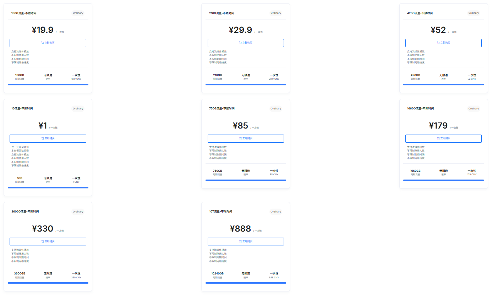

# Clash Meta 配置教程 · 科学上网客户端设置指南

[](LICENSE)
[]()
[]()

> 一份全面的 Clash Meta 配置教程，涵盖客户端安装、配置文件编写、分流策略设置，以及稳定可靠的代理机场推荐。

---

## 📋 目录

- [什么是 Clash Meta？](#什么是-clash-meta)
- [客户端下载与安装](#客户端下载与安装)
- [配置文件详解](#配置文件详解)
- [分流策略最佳实践](#分流策略最佳实践)
- [代理节点推荐](#代理节点推荐)
- [常见问题 FAQ](#常见问题-faq)

---

## 什么是 Clash Meta？

**Clash Meta**（现更名为 **mihomo**）是一个基于规则的跨平台代理客户端内核，支持多种代理协议，具备强大的规则分流能力。它最初是 Clash 项目的衍生版本，目前已成为社区最活跃的代理内核之一。

**核心特点：**

| 特性 | 说明 |
|------|------|
| 🚀 多协议支持 | Vmess、VLESS、Trojan、Hysteria2、Shadowsocks、AnyTLS 等 |
| 📐 规则分流 | 根据域名/IP/GeoIP 自动选择出口，国内直连 + 境外代理 |
| 🔄 自动切换 | 多节点间自动延迟测试，选择最优节点 |
| 📡 跨平台 | Windows、macOS、Linux、OpenWrt、Android 全覆盖 |
| 🧩 扩展性强 | 支持 TUN 虚拟网卡模式、DNS 劫持、Script 规则 |

---

## 客户端下载与安装

推荐以下主流图形化客户端（底层均使用 Clash Meta 内核）：

### Windows / macOS

| 客户端 | 平台 | 特点 |
|--------|------|------|
| [Clash Verge Rev](https://github.com/clash-verge-rev/clash-verge-rev) | Windows / macOS / Linux | ✅ 社区最活跃的 GUI 客户端，功能完整 |
| [Clash Nyanpasu](https://github.com/keiko233/clash-nyanpasu) | Windows / macOS / Linux | ✅ 现代化 UI，支持一键导入订阅 |

### 移动端

| 客户端 | 平台 | 特点 |
|--------|------|------|
| [Clash Meta for Android](https://github.com/MetaCubeX/ClashMetaForAndroid) | Android | ✅ 功能最全的 Android 客户端 |
| [Stash](https://stash.ws/) | iOS | 付费但功能强大的 iOS 客户端 |
| [Loon](https://www.loon.wiki/) | iOS | 支持规则编辑的 iOS 代理工具 |

> 💡 **提示**：安装后先不要急着配置，可以先用下方推荐的代理服务商订阅链接快速上手。

---

## 配置文件详解

Clash Meta 的核心是一个 YAML 格式的配置文件 `config.yaml`，它定义了代理节点、规则分组和分流策略。

### 基础配置模板

以下是一个可直接使用的模板（需配合订阅链接使用）：

<details>
<summary>📄 点击展开完整 config.yaml 模板</summary>

```yaml
# Clash Meta 配置示例
port: 7890
socks-port: 7891
allow-lan: true
mode: Rule
log-level: info
external-controller: :9090

# 代理节点 — 替换为你的订阅链接
proxy-providers:
  魔戒机场:
    type: http
    path: ./mojie.yaml
    url: "https://mojie.host/subscription/your_link"
    interval: 3600
    health-check:
      enable: true
      url: http://www.gstatic.com/generate_204
      interval: 300

# 代理组 — 策略组配置
proxy-groups:
  - name: 🚀 节点选择
    type: select
    proxies:
      - ♻️ 自动选择
      - DIRECT
    use:
      - 魔戒机场

  - name: ♻️ 自动选择
    type: url-test
    url: http://www.gstatic.com/generate_204
    interval: 300
    tolerance: 50
    use:
      - 魔戒机场

  - name: 🎯 全球直连
    type: select
    proxies:
      - DIRECT
      - 🚀 节点选择

  - name: 🐟 漏网之鱼
    type: select
    proxies:
      - 🚀 节点选择
      - 🎯 全球直连

# 规则 — 按照从上到下的优先级匹配
rules:
  # 国内网站直连
  - DOMAIN-SUFFIX,cn,🎯 全球直连
  - DOMAIN-SUFFIX,baidu.com,🎯 全球直连
  - DOMAIN-SUFFIX,taobao.com,🎯 全球直连
  - DOMAIN-SUFFIX,qq.com,🎯 全球直连
  - DOMAIN-SUFFIX,weibo.com,🎯 全球直连
  - DOMAIN-SUFFIX,zhihu.com,🎯 全球直连

  # AI 服务走代理
  - DOMAIN-SUFFIX,openai.com,🚀 节点选择
  - DOMAIN-SUFFIX,anthropic.com,🚀 节点选择
  - DOMAIN-SUFFIX,gemini.google.com,🚀 节点选择

  # 流媒体走代理
  - DOMAIN-SUFFIX,youtube.com,🚀 节点选择
  - DOMAIN-SUFFIX,netflix.com,🚀 节点选择
  - DOMAIN-SUFFIX,spotify.com,🚀 节点选择

  # GeoIP 规则
  - GEOIP,CN,🎯 全球直连

  # 剩余流量默认走代理
  - MATCH,🐟 漏网之鱼
```
</details>

### 配置要点

1. **proxy-providers** — 使用订阅链接自动拉取节点列表，无需手动维护
2. **proxy-groups** — 策略组划分，实现「国内直连 + 境外代理」的智能分流
3. **rules** — 规则匹配优先级从上到下，精确匹配优先
4. **mode** — `Rule` 模式按规则分流，`Global` 全局代理，`Direct` 全局直连

---

## 分流策略最佳实践

合理的分流策略能让你 **国内网站直连不减速，境外服务代理不掉线**。

### 推荐策略

```
┌─────────────┐
│  DNS 请求   │
└──────┬──────┘
       ▼
┌─────────────┐     ┌──────────────────┐
│ 域名后缀匹配 ├─────▶ 国内域名 → 直连   │
└──────┬──────┘     └──────────────────┘
       ▼
┌─────────────┐     ┌──────────────────┐
│  AI/流媒体   ├─────▶ 香港/日本节点代理  │
│  特殊域名    │     └──────────────────┘
└──────┬──────┘
       ▼
┌─────────────┐     ┌──────────────────┐
│  GeoIP 匹配  ├─────▶ 国内IP → 直连     │
└──────┬──────┘     └──────────────────┘
       ▼
┌─────────────┐
│  剩余 → 代理  │
└─────────────┘
```

### 节点选择技巧

- **香港节点** — 延迟最低，适合日常网页浏览和 AI 对话
- **日本/新加坡节点** — 流媒体解锁能力强，适合 YouTube、Netflix
- **美国节点** — 适合访问特定美区服务
- **自动选择** — 客户端每隔 5 分钟自动测速，选择延迟最低的节点

---

## 🚀 代理节点推荐

如果你还没有代理订阅，推荐我长期使用的 **[魔戒机场](https://mojie.host/register?aff=Pvs1RARA)**，按量计费、不限时间、支持 Clash Meta 协议一键导入。

### 为什么推荐魔戒机场？

- **按量计费，流量永不过期** — 买的流量用完为止，没有月付压力
- **全面兼容 Clash Meta** — 支持 Vmess、Hysteria2、AnyTLS 协议，订阅链接一键导入
- **全球节点覆盖** — 香港、日本、台湾、新加坡、韩国、美国等主流地区
- **AI 友好** — ChatGPT、Claude、Gemini 均可稳定访问
- **流媒体解锁** — YouTube、Netflix、Spotify 等流畅播放
- **支付宝 / 微信 / 加密货币** 多种支付方式
- **不限制设备数** — 一个订阅全家共享

### 套餐概览

| 流量 | 价格 | 特点 |
|------|------|------|
| 130G | ¥19.90 | 轻量使用，不限时间 |
| 210G | ¥29.90 | 日常足够用 |
| 420G | ¥52.00 | 中度用户推荐 ✅ |
| 750G | ¥85.00 | 重度用户首选 |
| 1660G | ¥179.00 | 团队共享 |
| 3600G | ¥330.00 | 大流量需求 |
| 10T | ¥888.00 | 超大户 |

> 👉 [**立即前往魔戒机场官网**](https://mojie.host/register?aff=Pvs1RARA) — 注册后获取订阅链接，在 Clash Verge 中一键导入即可使用。



---

## 常见问题 FAQ

<details>
<summary><b>Clash Meta 和原版 Clash 有什么区别？</b></summary>
Clash Meta（现 mihomo）是原版 Clash 的社区活跃分支，支持更多新协议（Hysteria2、VLESS、AnyTLS），性能和稳定性更优。目前社区推荐的默认选择。
</details>

<details>
<summary><b>如何查看自己的订阅链接？</b></summary>
在你的机场后台，通常会有「一键订阅」或「复制订阅链接」按钮。将链接粘贴到 Clash Verge 的「订阅管理」中即可自动拉取节点。
</details>

<details>
<summary><b>如何选择最快的节点？</b></summary>
Clash Verge 支持延迟测试（Delay Test），点击节点列表中的延迟测试按钮，客户端会自动 ping 每个节点，选择延迟最低的即可。
</details>

<details>
<summary><b>配置后无法访问国内网站怎么办？</b></summary>
检查配置中的规则是否包含国内域名直连规则（DOMAIN-SUFFIX,cn），以及是否开启了 TUN 模式。如果使用 TUN 模式，建议配合 DNS 配置使用。
</details>

<details>
<summary><b>魔戒机场支持退款吗？</b></summary>
魔戒机场采用按量计费，流量未使用完可以联系客服协商处理。建议先购买小流量套餐测试速度。
</details>

---

<sub>免责声明：本项目仅提供 Clash Meta 技术教程和代理信息分享，请遵守当地法律法规合理使用。</sub>
